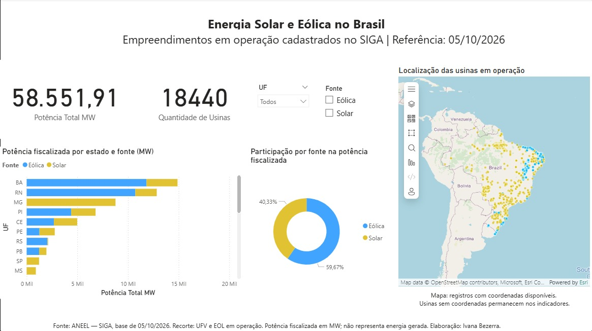
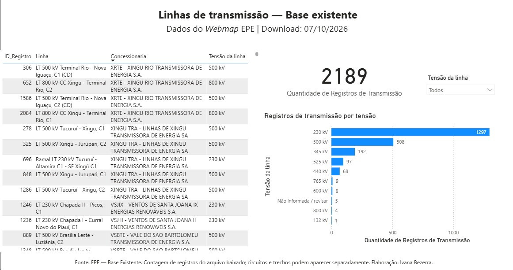
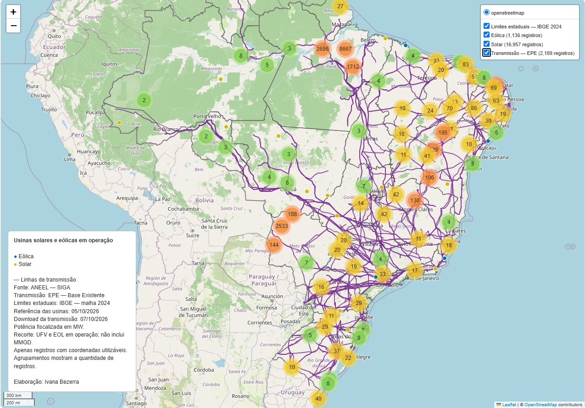

# Dashboard Geoespacial de Energia no Brasil

Projeto de portfólio desenvolvido por **Ivana Bezerra**, integrando Python, GeoPandas, Folium, QGIS e Power BI para explorar dados públicos de geração e transmissão de energia.

[**Explorar o mapa interativo**](https://ivanafbezerra-afk.github.io/dashboard-energia-brasil/) · [**Estudo de caso em PDF**](documentacao/estudo_de_caso_energia_brasil_IvanaBezerra.pdf) · [**Scripts Python**](scripts/)

## Objetivo

Visualizar a distribuição das usinas solares e eólicas em operação, comparar sua potência fiscalizada por estado e fonte e apresentar os registros de linhas de transmissão do arquivo obtido no Webmap EPE.

## Resultados

| Indicador | Resultado |
|---|---:|
| Usinas solares e eólicas em operação | 18.440 |
| Potência fiscalizada do recorte | 58.551,91 MW |
| Participação eólica na potência | 59,67% |
| Participação solar na potência | 40,33% |
| Usinas com coordenadas utilizáveis | 18.093 |
| Usinas sem coordenadas | 347 |
| Registros no arquivo de transmissão | 2.189 |

A potência em MW representa a potência fiscalizada cadastrada, não a energia gerada em MWh. O recorte contempla UFV e EOL em operação no SIGA e não inclui micro e minigeração distribuída (MMGD).

## Visualizações

### Usinas solares e eólicas

Indicadores de potência e quantidade de usinas, comparação por UF, participação por fonte, filtros e mapa de localização.



### Linhas de transmissão

Contagem de registros, distribuição por tensão, filtro de classe de tensão e consulta dos atributos das linhas. Cinco registros com tensão zerada foram classificados como “Não informada / revisar”.



### Mapa interativo

Camadas de usinas solares, eólicas, transmissão e limites estaduais. Inclui agrupamentos de marcadores, controle de camadas e consulta de atributos.



## Dados e referências

| Fonte | Conteúdo | Referência utilizada |
|---|---|---|
| [ANEEL - Dados Abertos / SIGA](https://dadosabertos.aneel.gov.br/) | Empreendimentos de geração | 05/10/2026 |
| [EPE - Webmap](https://www.epe.gov.br/pt/publicacoes-dados-abertos/publicacoes/webmap-epe) | Linhas de transmissão - Base Existente | Download em 07/10/2026 |
| [IBGE - Malha territorial](https://geoftp.ibge.gov.br/organizacao_do_territorio/malhas_territoriais/malhas_municipais/municipio_2024/Brasil/) | Limites das unidades da Federação | Malha 2024 |

A data de download da transmissão não equivale à data de atualização de cada registro.

## Metodologia

1. Leitura dos arquivos públicos a partir de caminhos locais.
2. Seleção das usinas UFV e EOL em operação; padronização das colunas e conversão da potência de kW para MW.
3. Tratamento numérico das coordenadas e seleção dos registros utilizáveis no mapa.
4. Cruzamento espacial dos pontos com a malha estadual, comparação entre a UF cadastrada e a localização e exportação dos casos para revisão.
5. Inspeção de exemplos no QGIS e construção de indicadores no Power BI.
6. Criação do mapa Folium com camadas, atributos e agrupamentos.
7. Simplificação das geometrias de exibição para reduzir o HTML: tolerância de 200 m para estados e 50 m para transmissão, em EPSG:5880, com retorno a EPSG:4326 para o mapa. Os arquivos originais são preservados.

## Validação espacial

| Situação | Registros |
|---|---:|
| UF compatível com o ponto | 18.046 |
| UF divergente | 46 |
| Sem correspondência com polígono estadual | 1 |
| Sem coordenadas | 347 |

Os 47 casos divergentes ou sem correspondência foram sinalizados para revisão. Dois exemplos foram inspecionados no QGIS: Vila Acre I, cadastrada no RN e com ponto na Bahia, e Mucuripe, próxima à costa do Ceará e sem correspondência na malha utilizada. A verificação não determina sozinha qual campo precisa de correção.

Usinas sem coordenadas permanecem nos indicadores tabulares. A compatibilidade com uma UF não comprova a precisão da localização da usina.

## Organização dos arquivos

| Caminho | Conteúdo |
|---|---|
| `index.html` | Mapa Folium publicado no GitHub Pages |
| `scripts/` | Scripts Python de tratamento, validação e visualização |
| `dados_tratados/` | Tabelas CSV utilizadas no projeto |
| `imagens/` | Capturas dos dashboards e do mapa |
| `documentacao/` | Estudo de caso em PDF |
| `dashboard_energia_brasil.pbix` | Relatório do Power BI Desktop |

## Execução local

O mapa publicado pode ser acessado pelo navegador. É necessária conexão com a internet para carregar o mapa-base e as bibliotecas externas.

Para gerar novamente o mapa, instale as dependências no ambiente Python usado pelo Spyder:

```bash
python -m pip install pandas geopandas folium
```

Organize os arquivos locais nos caminhos esperados pelo script:

- `dados_tratados/usinas_operacao.csv`;
- `dados_brutos/estados/BR_UF_2024.shp`, acompanhado dos demais arquivos do shapefile;
- shapefile de transmissão e seus arquivos associados em `dados_brutos/transmissao/`.

Ajuste `PASTA_PROJETO` em `scripts/criar_mapa.py` para a pasta do projeto no seu computador. Execute o arquivo inteiro no Spyder ou com:

```bash
python scripts/criar_mapa.py
```

O script salva `mapas/mapa_usinas_brasil.html` e inicia um servidor local para visualização. No Spyder, mantenha o console ativo enquanto utiliza esse endereço local. Para atualizar a versão publicada, copie o HTML gerado para o `index.html` da raiz deste repositório.

Para explorar o relatório, abra o `.pbix` no Power BI Desktop. Para atualizar as tabelas, ajuste os caminhos das fontes de dados para a pasta local correspondente.

## Limites de interpretação

- Os resultados descrevem o recorte e as datas utilizados, não a totalidade da matriz elétrica brasileira.
- Os 2.189 itens são registros do arquivo baixado; circuitos e trechos podem aparecer separadamente. A cobertura nacional do download não foi auditada.
- A proximidade no mapa não comprova conexão elétrica entre usinas e linhas.
- As geometrias simplificadas servem à visualização; análises espaciais devem utilizar os dados originais.
- A disponibilização do `.pbix` permite seu download; o mapa interativo publicado foi construído com Folium.

## Autoria

**Ivana Bezerra** — Engenharia Aeroespacial, geoprocessamento e análise de dados.

Projeto independente de portfólio elaborado com dados públicos. Não constitui produto oficial da ANEEL, da EPE ou do IBGE.
